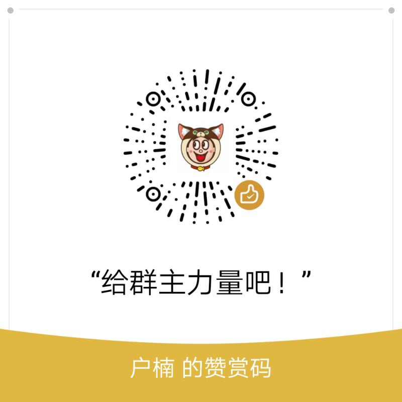
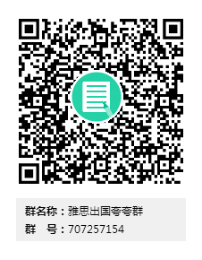

# 自用的托福雅思资料分享
-------------
 【声明】本资料是备考期间从网络中搜索获取，答主进行整理，无任何商业目的。所有资料请不要肆意传播，仅供自己复习备考。如版权方觉得侵犯版权，请联系我进行删除。
<!---->
## *百度云不限速下载
https://www.baiduwp.com/   打开这个网址，输入链接就可以直接下载  

## *雅思

更多资料，雅思出国夸夸群：707257154 请加群免费获取。
 
 
 
## *托福
1819托福真题：链接：https://pan.baidu.com/s/1y1_LbblefM0x2lKWjWN8Og 提取码：kj6s  
子睿老师写作：链接：https://pan.baidu.com/s/1FnEiHfKBfHLnnIMu_z5Wkw 提取码：r3kq  
张艳听力：链接：https://pan.baidu.com/s/1UkY6REBiX07gM1RTu8fmyg 提取码：3pk1  
美国申请全系列视频：链接：https://pan.baidu.com/s/1qwbvWgMC-FJCLJcMXsLqIw 提取码：l1x0  
阿武老师写作：链接：https://pan.baidu.com/s/129g9VKGy-UeWLuzGtXafqQ 提取码：5zty  
托你的福写作满分计划：链接：https://pan.baidu.com/s/1le4G-jWF5t75wT7dN-aP7w 提取码：7bl6  
子睿口语视频：链接：https://pan.baidu.com/s/1avRYQcGXloI0MvfCca0z-w 提取码：78oc  
onepass写作：链接：https://pan.baidu.com/s/1DBsOe-kwRvcjlQTUlarJDQ 提取码：2p51  
Fiona听力链接：https://pan.baidu.com/s/1i3BrIA2WyzFznretgP88uw 提取码：200w  
fiona口语链接：链接：https://pan.baidu.com/s/18l61LHuOaCfeCiPfATXJaw 提取码：j0et   
托你的福1月听力和阅读听力真题：链接：https://pan.baidu.com/s/1SLcGmttBUvkNOP4BimI-Lw 提取码：9rgb   

 
     
 
【失效问题】如果哪个资料链接失效，请加群告知  
【欢迎加入雅思备考夸夸qq群，一起夸夸】707257154  

